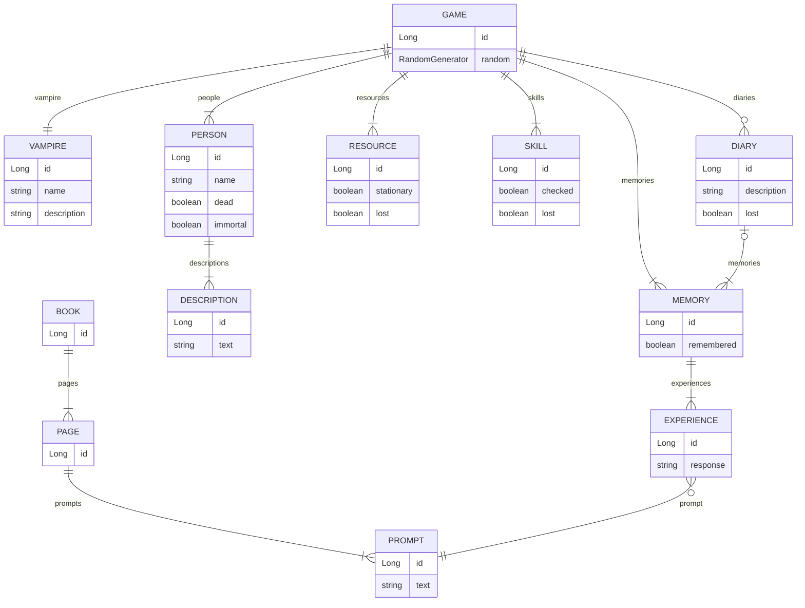

```mermaid
erDiagram
    BOOK ||--|{ PAGE : pages
    PAGE ||--|{ PROMPT : prompts
    GAME ||--|| VAMPIRE : vampire
    GAME ||--|{ PERSON : people
    PERSON ||--|{ DESCRIPTION : descriptions
    GAME ||--|{ RESOURCE : resources
    GAME ||--|{ SKILL : skills
    GAME ||--|{ MEMORY : memories
    DIARY o|--|{ MEMORY : memories
    GAME ||--o{ DIARY : diaries
    MEMORY ||--|{ EXPERIENCE : experiences
    EXPERIENCE }o--|| PROMPT : prompt
    BOOK {
        Long id
    }
    PAGE {
        Long id
    }
    PROMPT {
        Long id
        string text
    }
    GAME {
        Long id
        RandomGenerator random
    }
    VAMPIRE {
        Long id
        string name
        string description
    }
    PERSON {
        Long id
        string name
        boolean dead
        boolean immortal
    }
    RESOURCE {
        Long id
        boolean stationary
        boolean lost
    }
    SKILL {
        Long id
        boolean checked
        boolean lost
    }
    MEMORY {
        Long id
        boolean remembered
    }
    DIARY {
        Long id
        string description
        boolean lost
    }
    DESCRIPTION {
        Long id
        string text
    }
    EXPERIENCE {
        Long id
        string response
    }
```
